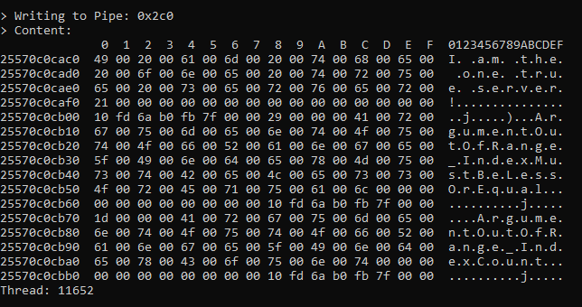
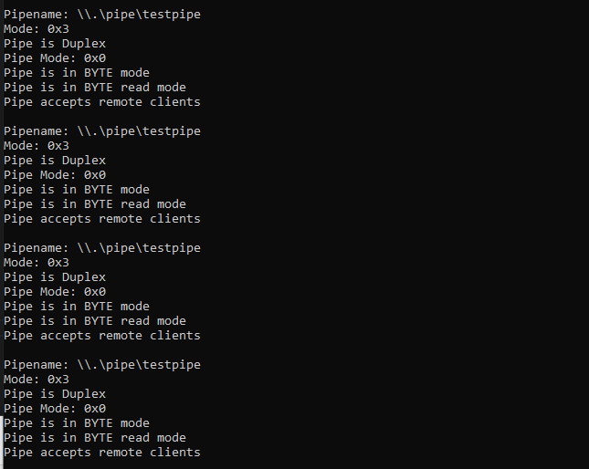

# Peep

A tool designed to hook into Windows applications and output named \(and anonymous?\) pipe traffic.

## Why?

During Thick Client Penetration Testing engagements, applications occasionally utilise Named Pipes for communication between the clients and locally hosted servers.
This tool was made to intercept this traffic to identify sensitive data or potential vulnerabilities.

## How?

This tool utilises the Frida dynamic instrumentation toolkit to hook into target processes. It then intercepts calls to the `CreateFile` and `CreateNamedPipe` Windows APIs to discern pipe file handles.
All calls to the `ReadFile` and `WriteFile` Windows API functions are then intercepted, if the file handles correspond to pipes, a memory dump of the pipe or input buffer contents is printed to the console.




This tool can be used to hook both new and running instances of the target application, the former providing more information regarding the created pipes as well their path names, as shown below:



## Installation

Using a Windows system or VM with Python and Pip:
```
pip install frida-tools
```

## Usage

To hook a new instance of the application, run the following command:
```
frida server.exe -l peep.js
```

To hook a running instance of the application, identify the target's PID using `Task Manager`'s `Details` view and run the following command:
```
frida -p 12345 -l peep.js
```
